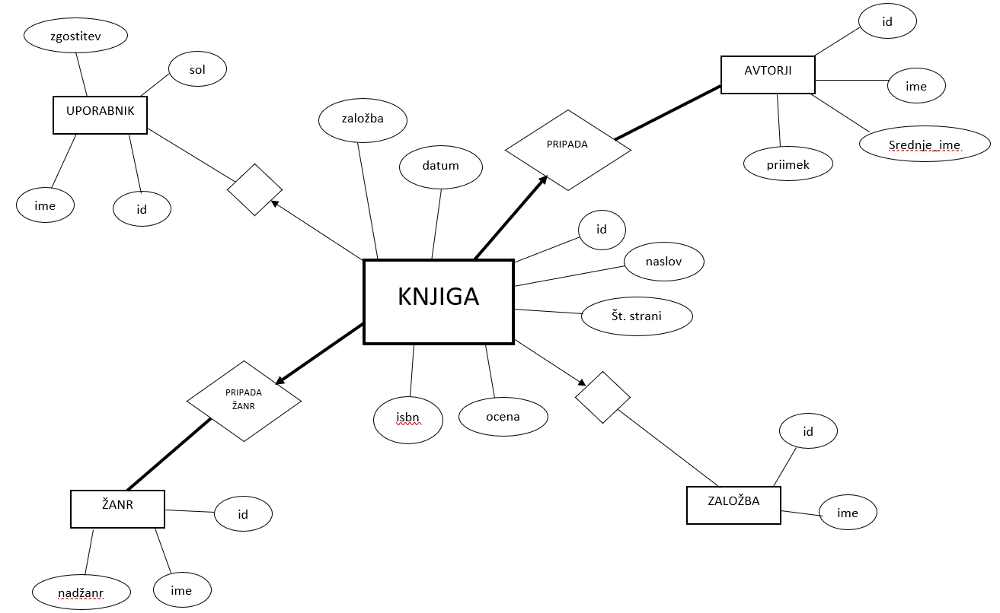

# Knjigarna

Projektna naloga pri predmetu Podatkovne baze.

Baza za hranjenje podatkov o knjigah (ocena, datum izdaje, število strani, opis...), njihovih avtorjih, žanrih in založbah, v katerih so bile izdane.

